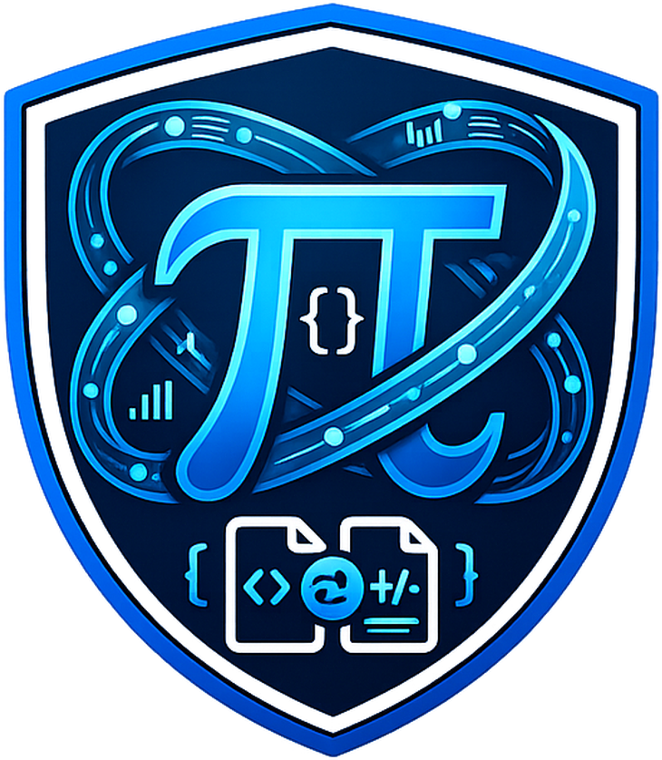
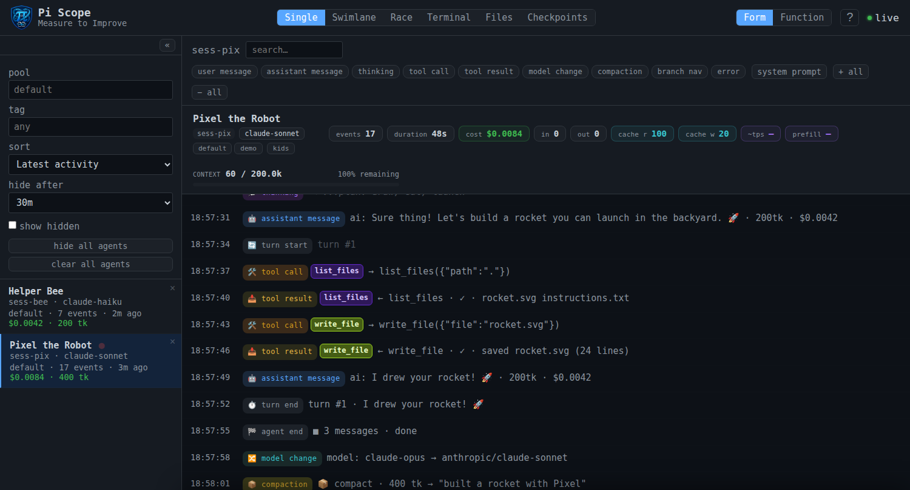
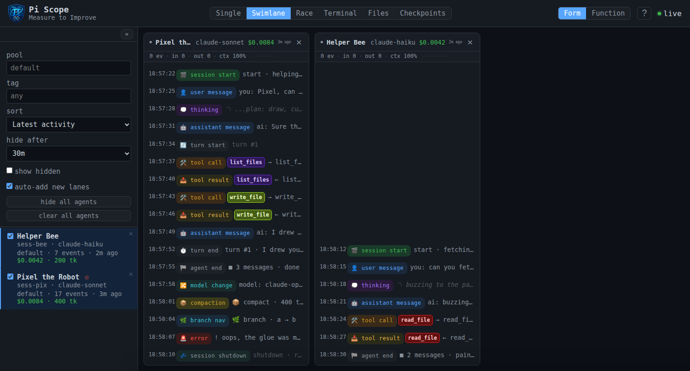
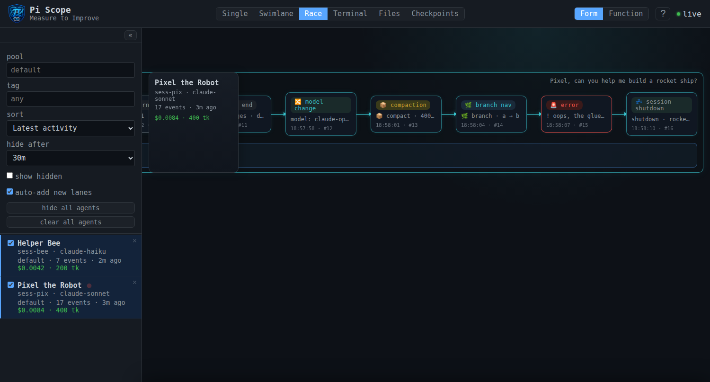
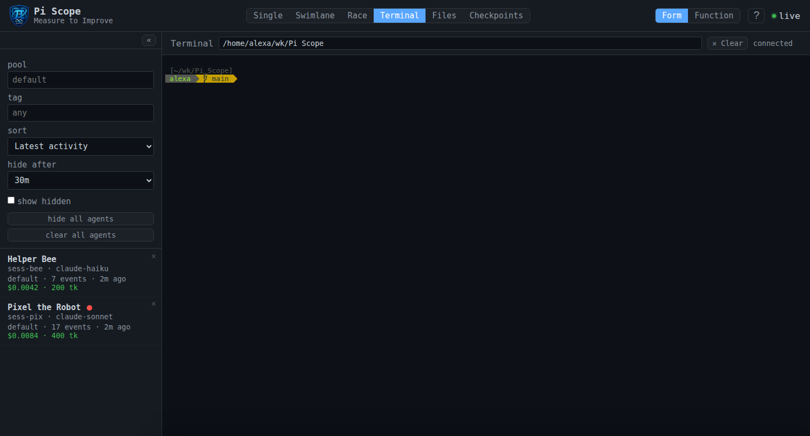
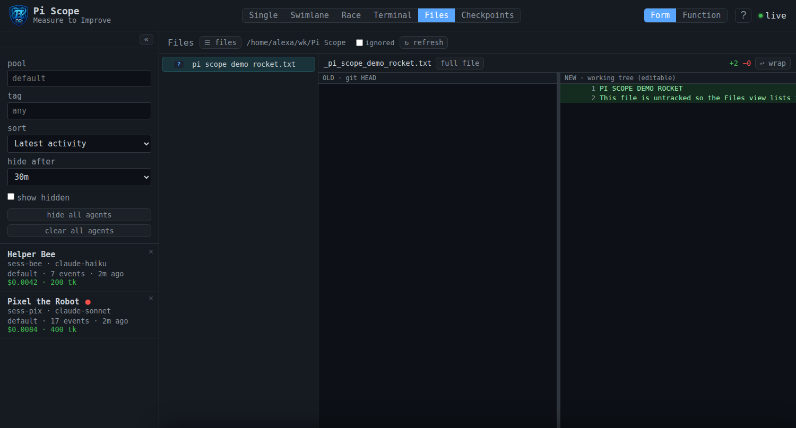
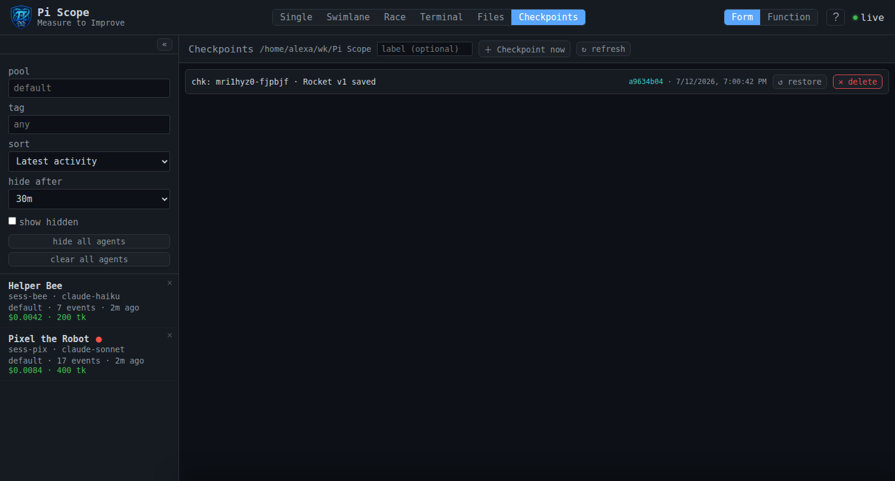

# Pi Scope



Pi Scope is a live dashboard for watching an AI coding agent work — every message, tool
call, shell command, and file edit, rendered in a browser UI you can watch or replay.

## Getting started

Pi Scope is two pieces: a **server + dashboard** that you open, and a **pi extension**
that feeds it agent telemetry. Get the server running first, then point a `pi` agent at
it so the dashboard has something to show.

### Run the AppImage (no build — end users)

The release is a self-contained Linux AppImage that bundles its own Node 24 plus the
server and WebUI. Double-click it (or run it from a shell) and it boots the server and
opens the dashboard in an embedded browser — no `npm`, no dev dependencies.

```bash
chmod +x Pi-Scope-1.0.0.AppImage
./Pi-Scope-1.0.0.AppImage
```

- Data (SQLite DB + per-run auth token) lives in `~/.local/share/pi-scope/`, so it
  survives relaunch and never writes into the read-only AppImage mount.
- Closing the window stops the server it started. If a server is already listening on
  the port, the AppImage reuses it instead of starting a second one.
- Built with `./build-release.sh` → `apps/scope-launcher/dist/Pi-Scope-<version>.AppImage`.
  An extracted `linux-unpacked/` directory is also produced if you prefer that over a
  single file.

### Install the pi extension (`extension/pi-scope.ts`)

The dashboard is empty until a `pi` agent feeds it. This extension hooks the agent
lifecycle and streams events to the server, auto-discovering its auth token.

**One session** — pass the path when you launch `pi`:

```bash
pi -e /path/to/Pi_Scope/extension/pi-scope.ts
```

**Every session** — add it to your pi agent config so it loads automatically:

```json
// ~/.pi/agent/settings.json
{
  "extensions": [
    "/absolute/path/to/Pi_Scope/extension/pi-scope.ts"
  ]
}
```

(Or copy `extension/pi-scope.ts` into `~/.pi/agent/extensions/` and list it as
`"+extensions/pi-scope.ts"`.)

The extension finds the token in dev from `tmp/scope_token`, and from
`~/.local/share/pi-scope/scope_token` when running the AppImage, so you usually set
nothing else. If your server isn't on the default port, point the extension at it with
`--obs-server-url` (flag) or `OBS_SERVER_URL` (env); both default to
`http://127.0.0.1:43190`.

### Run from the git repo (developers)

```bash
git clone https://github.com/NerdAtWork24X7/Pi_Scope.git Pi_Scope && cd Pi_Scope
apps/scope-launcher/run.sh                 # requires Node.js 24+ (uses node:sqlite)
```

Open the URL it prints (`http://127.0.0.1:43190/?token=<uuid>`), then launch `pi` with
the extension (above) to feed it. The server writes its per-run token to `tmp/scope_token`
(mode `0600`) for the extension to pick up.

> `npm run dev` adds `--watch`. The DB defaults to `db/scope.db`. Override with the
> `SCOPE_PORT`, `SCOPE_HOST`, and `SCOPE_AUTH_TOKEN` environment variables.

## Using the UI

## The layout

- **Top bar** — view buttons: `Single` · `Swimlane` · `Race` · `Terminal` · `Files` · `Checkpoints`. A live dot is green when the live feed (SSE) is connected, red when off.
- **Left sidebar** — the session list. Click a session name to open it in Single view. Collapse the sidebar with the `«` toggle (your choice is remembered).
- **Session rows** show the agent name, model + short id (`abcd1234 · claude-…`), `pool · N events · relative time`, cost/tokens, and a **red error dot** when a tool error occurred (clicking the session acknowledges it). A `hidden`/`aged` note and a hide/unhide `×`/`↺` button appear per row.



## Filters & search (top of sidebar)

- **Pool** and **Tag** text boxes narrow the list and reconnect the live feed.
- **Sort** select: `latest` / `errors` / `expensive`.
- **Hide after** select: `30m` / `1h` / `never` — auto-hide quiet sessions.
- **Show hidden** checkbox — reveal hidden sessions.
- **Search box** (Single view only, after selecting a session) — live-filters events by text or JSON. Press `/` to focus it.
- **Type filter chips** (Single view) — toggle which event types show: `user_message`, `assistant_message`, `thinking`, `tool_call`, `tool_result`, `model_change`, `compaction`, `branch_nav`, `error`.

## Single view (timeline)

Each event row is **time · type pill · summary**. Click a row to expand its full JSON detail.

- In the expanded detail: `📋` copies the event, `→`/`↩` toggles word wrap. A `tool_result` shows an exit-code chip (`exit N`, ok/err); an `assistant_message` shows latency/turn chips.
- `Expand all` / `Collapse all` buttons.
- The system-prompt button (`📋`) opens an overlay with the agent's system prompt (copy/close).
- The session subnav shows stats: event count, duration, cost, input/output tokens, cache read/write, TPS, prefill, and a **context-usage bar** (`context used / total — N% remaining`; green <70%, orange 70–90%, red >90%).
- Live events pulse in. Scroll up to pause auto-scroll — a `paused — click to resume` toast lets you re-enable it.

## Swimlane view

In the sidebar, tick a session's checkbox (or click its name) to add it as a **lane**. The `☐ auto-add new lanes` checkbox (on by default) auto-adds lanes for new sessions.

- Each lane header shows name / model / cost / age and a green dot when live; `×` closes the lane.
- Click any event row in a lane to expand its JSON; `📋` copies it.
- Scrolling up shows a `↓ paused — click to resume` toast.



## Race view

Same lane/track selection as Swimlane. Tracks render an agent's work as **turn groups**
labeled `setup` / `turn N` — click a group to expand its prompt, events, and final response
(or `no final response captured`).

- Click any event card → an **Inspector** panel on the right with `📋` copy, `↩` wrap, `×` close (or `Esc`).
- For `user_message` events only, tabs **`[payload]`** and **`[llm request]`** switch between raw JSON and the system-prompt/tools/model view.
- A rollup bar shows aggregate `$cost · tokens` across all tracks.



## Terminal view

Opens a **real shell on the server host** (via WebSocket). It auto-connects when you open
the view and stays connected across view switches (it only closes when you leave the page).

- Just type — keystrokes forward to the shell.
- **Right-click** for a context menu with `[Copy]` and `[Paste]` (Copy is disabled when nothing is selected).
- The shell's working directory is shared with the Files and Checkpoints panes — the cwd label updates live as you `cd`.
- The terminal auto-fits when shown and on window resize.



## Files view

Toolbar: `☰ files` toggle, cwd label, `☐ ignored` checkbox (show ignored files), `↻ refresh`.

- **File tree**: click a file to open a side-by-side diff (left = HEAD/old, right = working tree/new); click a folder to expand/collapse.
- **Diff toolbar**: filename; `full file` / `changes only` toggle; stats (`+N −M`, `changes only`, `● unsaved` when dirty); `💾 save` and `✕ cancel` (shown when you edit); `↩ wrap` toggle.
- The right pane is editable — type to change the working tree. Per-line `→` / `←` buttons copy a line across panes. Drag the divider to resize; scrolling one pane syncs the other. Lines are colored eq / del / add / change.



## Checkpoints view

Type an optional label, then click **`＋ Checkpoint now`** to snapshot the working tree
(git-backed).

- Each checkpoint shows its message, short SHA, and timestamp, with `↺ restore` and `✕ delete` buttons.
- **Create** also switches the repo's current branch (HEAD) to the new `checkpoints/<ns>/<id>` branch. **Delete** of a checked-out checkpoint branch first switches HEAD to the previous checkpoint branch (or the base branch) before removing it; uncommitted changes stay in the working tree — merge them elsewhere first.
- **Restore** confirms, then runs `git reset --hard` + `git clean -fd` — destructive; uncommitted and untracked changes are discarded.
- **Delete** confirms, then removes the git ref.
- Needs a working directory (set in the Terminal pane) and git available. Empty states: `no working directory set — choose one in the Terminal pane`, `no checkpoints yet — click "Checkpoint now"`, `git unavailable in <cwd>`.



## Keyboard shortcuts (Single view)

Disabled while the Terminal view is open.

| Key | Action |
|-----|--------|
| `?` | Toggle help overlay |
| `/` | Focus the search box |
| `j` / `↓` | Move focus down one event |
| `k` / `↑` | Move focus up one event |
| `Enter` / `Space` | Toggle the focused event's detail |
| `Esc` | Collapse all open details (or close the system-prompt overlay) |
| `g` | Jump to first event |
| `G` | Jump to last event |

## Tips

- **UI state lives in the URL hash** — view, filters, selected session, and swimlane/race lanes are all saved there, so you can bookmark or share a view. The auth token stays in the `?token=` query string, not the hash.
- Sessions **auto-refresh every 10s** and stream live over SSE, so new agents and events appear without reloading.

## Where data comes from

The UI is empty until something feeds it. Fastest options:

- Attach the extension to a `pi` agent — see **Install the pi extension** above (it auto-discovers the token).
- Or POST events directly to `POST /events` (needs `event_id`, `type`, `session_id`).

This is fork of https://github.com/disler/pi-agent-observability
