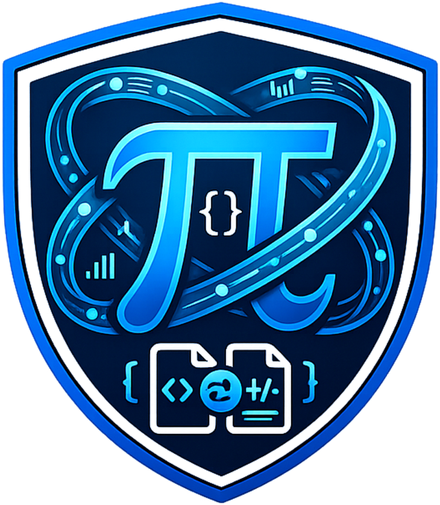
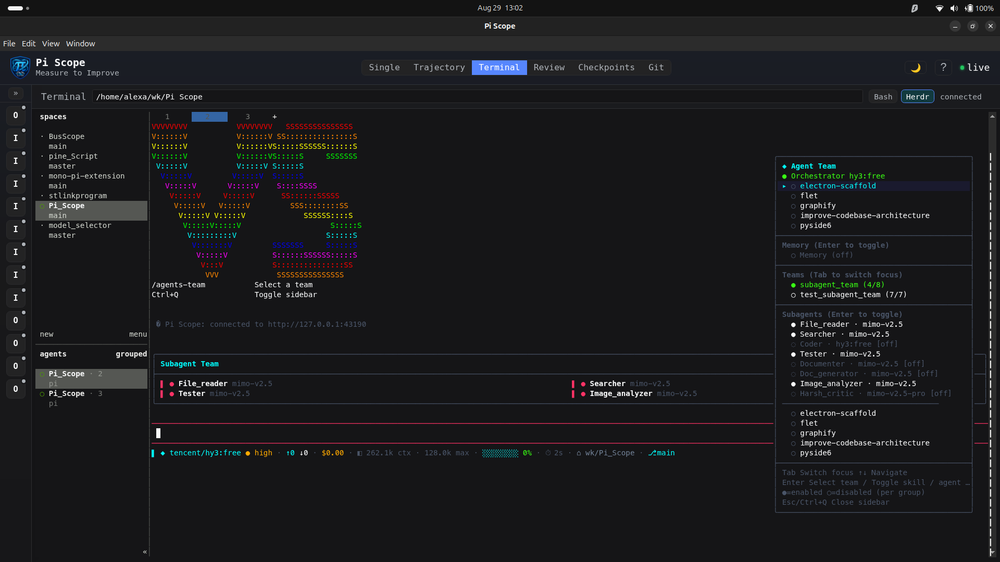
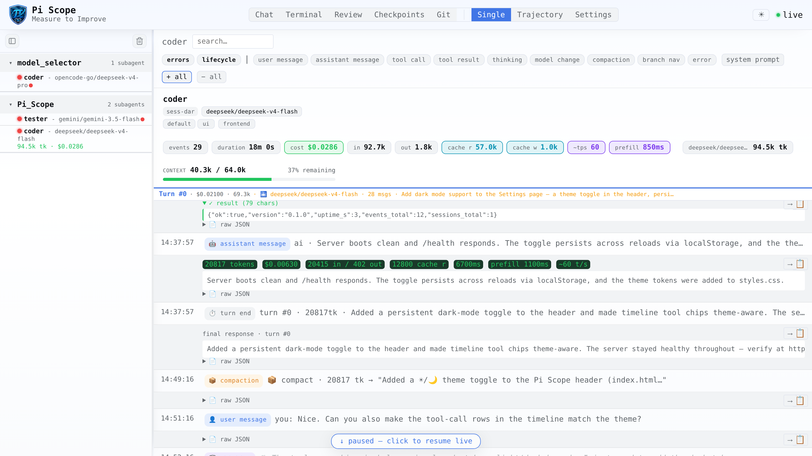
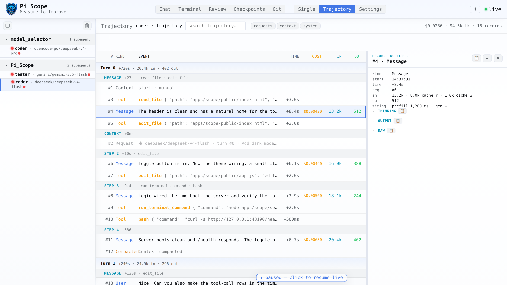
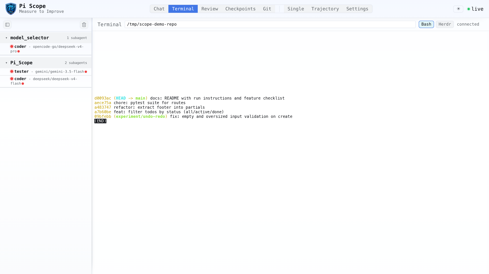
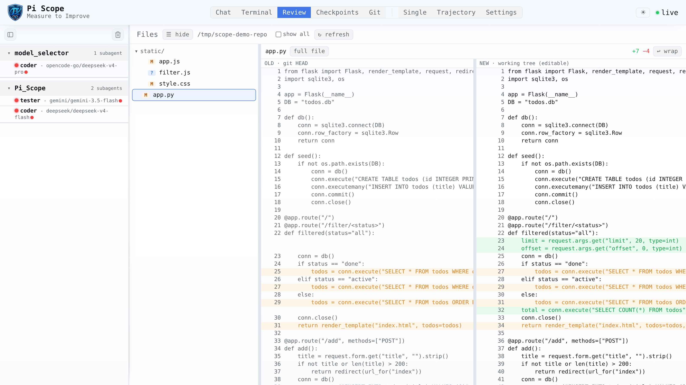
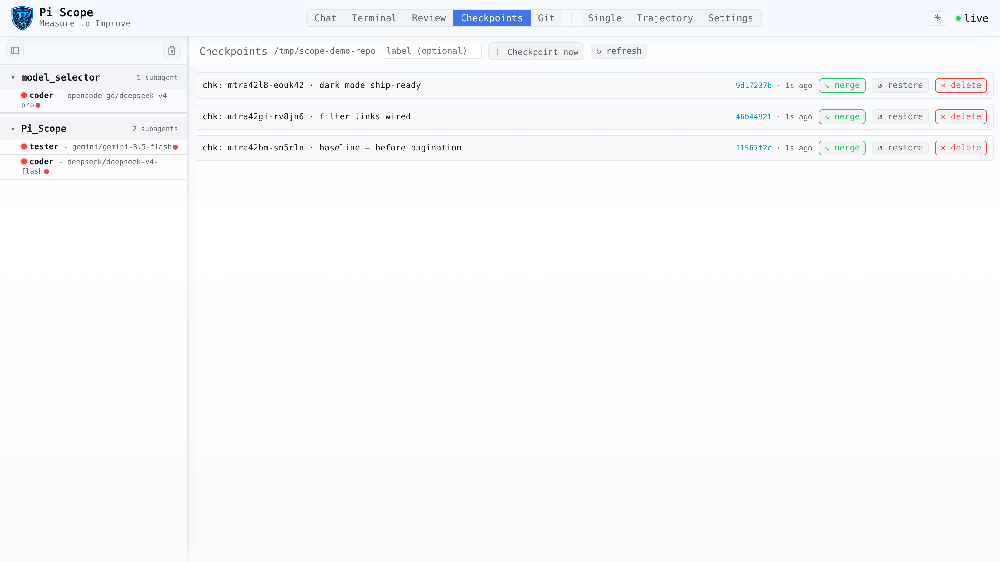
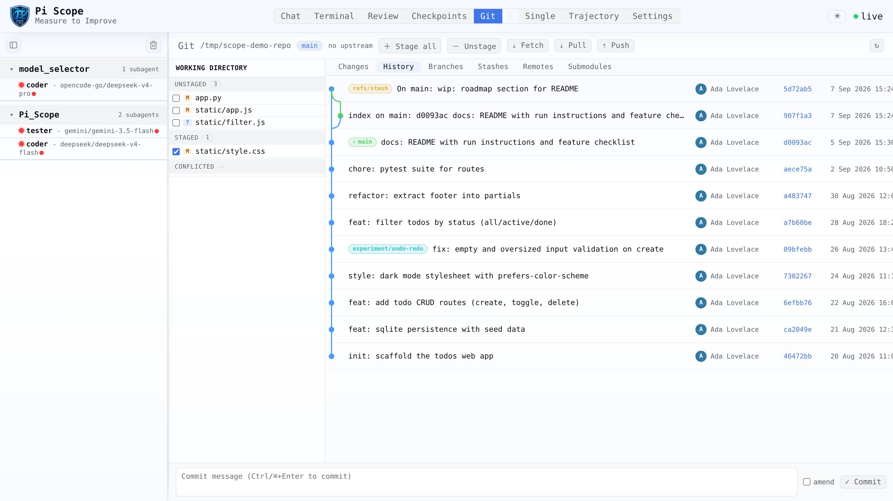

# Pi Scope

<p align="center">
  
</p>

<p align="center">
  <b>Watch an AI coding agent think, type, and act — live, locally, and replayable.</b>
</p>

**Pi Scope** is a local-first observability dashboard for AI coding agents. It streams
everything an agent does — every message, tool call, shell command, and file edit — into a
browser UI you can watch in real time or replay later.

Unlike cloud LLM tracers, it is **private by default** (runs on your machine, no account,
no upload). Unlike a plain terminal log, it lets you **act**: open a real shell, diff and
edit files, take git checkpoints, and run a full git client — all from the same screen.

> Pi Scope observes the [`pi`](https://github.com/disler/pi-agent-observability) coding
> agent through a small extension, but **any** tool that POSTs events to its `/events`
> endpoint can feed it. This project is an actively extended, locally-focused fork of
> [disler/pi-agent-observability](https://github.com/disler/pi-agent-observability).

---

## Why Pi Scope is different

Most "agent observability" tooling falls into two buckets: **cloud LLM tracers**
(LangSmith, Langfuse, Helicone, AgentOps) that record model calls for debugging, and
**chat/terminal logs** that just print what happened. Pi Scope sits in a different
category — a **live control-room for coding agents**:

- **It watches the whole loop, not just the model.** Messages, tool calls, shell
  commands, file edits, compactions, model switches, and branch navigation — captured and
  time-ordered, not just token traces.
- **Local-first and private by design.** No cloud, no account, no telemetry leaving your
  machine. Events land in a local SQLite database; the self-contained AppImage bundles its
  own Node 24, so there is nothing to install and nothing to upload.
- **Watch *and* act from one screen.** Pi Scope is not read-only. It embeds a real shell
  on the agent's host, a side-by-side file diff/editing view, git-backed checkpoints, and
  a complete git client. See a bad edit? Revert it, checkpoint, or `git reset` without
  leaving the dashboard.
- **Built for coding agents specifically.** It understands tool calls, shell output,
  working-directory context, context-window usage, per-turn cost/tokens, and throughput
  (TPS) — the things that actually matter when an agent is writing code.
- **Deep LLM request inspection.** The exact request arguments (`temperature`,
  `max_tokens`, `top_p`, `thinking`, `reasoning_effort`, `stop`, `stream`,
  `response_format`, …) are captured regardless of provider naming, alongside the system
  prompt — so you can see *exactly* what was sent to the model.
- **Replay and audit.** Every session is persisted and fully replayable, with live
  streaming over SSE while it runs.
- **Herdr-aware.** The terminal mirrors a Herdr terminal-multiplexer session's focused-pane
  working directory, so the Files and Checkpoints panes follow whatever you are actually
  driving.

---

## Advantages at a glance

| Capability | Pi Scope | Cloud LLM tracers (LangSmith / Helicone / AgentOps) | Plain terminal / chat logs |
|---|:---:|:---:|:---:|
| Runs locally, no account | ✅ | ❌ (cloud / SaaS) | ✅ |
| Privacy — nothing leaves your machine | ✅ | ❌ (data uploaded) | ✅ |
| Live watching of agent actions | ✅ | ⚠️ traces only | ⚠️ scrolling text |
| Replay past sessions | ✅ | ✅ | ❌ |
| **Control surface** (shell, file edit, git) | ✅ | ❌ | ⚠️ manual, separate |
| Coding-agent awareness (tool calls, cwd, context %) | ✅ | ⚠️ LLM-centric | ❌ |
| Exact LLM request args captured | ✅ | ⚠️ varies | ❌ |
| Zero-install (AppImage w/ bundled Node) | ✅ | n/a | n/a |
| Open source | ✅ | ⚠️ varies | ✅ |

**Who it's for:** developers and teams running autonomous coding agents who want to *see
what the agent is doing, understand why, and step in* — without shipping their code or
prompts to a third-party cloud.

---

## Feature tour

<p align="center">
  <a href="docs/video/Pi-Scope-5.0.0-features_1.mp4">▶ Watch the feature tour — Part 1 (mp4)</a>
</p>
<p align="center">
  <a href="docs/video/Pi-Scope-5.0.0-features_2.mp4">▶ Watch the feature tour — Part 2 (mp4)</a>
</p>
<p align="center">
  <a href="docs/video/Pi-Scope-5.0.0-features_3.mp4">▶ Watch the feature tour — Part 3 (mp4)</a>
</p>

- **Pi Coding agent** - 
 

- **Single (timeline)** — a live, time-ordered feed of every event: messages, thinking,
  tool calls, tool results, errors. Click any row to expand its full JSON. A context-usage
  bar (`context used / total — N% remaining`), cost/token stats, latency, and an estimated
  tokens/sec for the latest turn are shown up top. The **system prompt** button opens the
  exact request args sent to the model.
  

- **Trajectory** — a turn-aware ledger that folds events into **Turns**, with Message and
  Tool rows showing time, cost, and in/out token columns. An overview strip visualizes each
  record's start and duration, and a Record Inspector on the right shows full payloads.
  Great for understanding *flow* and *where time went*.
  

- **Terminal** — a **real shell on the agent's host** (over WebSocket, via xterm.js). Pick
  **Bash** or **Herdr** (a terminal multiplexer). The shell's working directory is shown in
  the header and is shared with the Files and Checkpoints panes; with Herdr it follows the
  pane you are actively driving.
  

- **Review (Files)** — a file tree with a side-by-side diff of the selected file (left =
  git HEAD / OLD, right = working tree / NEW, editable). Added/changed lines are green,
  removed lines red, and the right pane is editable so you can fix an agent's change in
  place.
  

- **Checkpoints** — git-backed snapshots of the working tree. Label a moment, restore it
  later with one click, or branch off it.
  

- **Git** — a full in-browser git client: **Changes**, **History** (commit lane graph),
  **Branches**, **Stashes**, **Remotes**, and **Submodules**. Stage/unstage/discard,
  commit (with amend), and push/pull/fetch without leaving the dashboard.
  

The top bar shows a live dot (green when the SSE feed is connected) and a session sidebar
with search, filters (pool / tag / sort / hide-after), and per-session error indicators.

---

## Quick start

Pi Scope is two pieces: a **server + dashboard** you open, and a **`pi` extension** that
feeds it agent telemetry. Get the server running first, then point an agent at it.

### Option A — Run the AppImage (end users, no build)

The release is a self-contained Linux AppImage that bundles its own Node 24 plus the
server and WebUI. Double-click it (or run it from a shell) — no `npm`, no dev
dependencies.

```bash
chmod +x Pi-Scope-1.0.0.AppImage
./Pi-Scope-1.0.0.AppImage
```

- Data (SQLite DB + per-run auth token) lives in `~/.local/share/pi-scope/`, so it survives
  relaunch and never writes into the read-only AppImage mount.
- Closing the window stops the server it started. If a server is already listening on the
  port, the AppImage reuses it instead of starting a second one.
- Build it yourself with `./build-release.sh` →
  `apps/scope-launcher/dist/Pi-Scope-<version>.AppImage` (an extracted `linux-unpacked/`
  directory is also produced).

### Option B — Install the `pi` extension (`extension/pi-scope.ts`)

The dashboard is empty until an agent feeds it. This extension hooks the agent lifecycle
and streams events to the server, auto-discovering its auth token.

**One session** — pass the path when you launch `pi`:

```bash
pi -e /path/to/Pi_Scope/extension/pi-scope.ts
```

**Every session** — add it to your `pi` agent config so it loads automatically:

```json
// ~/.pi/agent/settings.json
{
  "extensions": [
    "/absolute/path/to/Pi_Scope/extension/pi-scope.ts"
  ]
}
```

(Or copy `extension/pi-scope.ts` into `~/.pi/agent/extensions/` and list it as
`"+extensions/pi-scope.ts"`.)

The extension finds the token in dev from `tmp/scope_token`, and from
`~/.local/share/pi-scope/scope_token` when running the AppImage, so you usually set
nothing else. If your server isn't on the default port, point the extension at it with
`--obs-server-url` (flag) or `OBS_SERVER_URL` (env); both default to
`http://127.0.0.1:43190`. See [`extension/README.md`](extension/README.md) for the full
flag/env and event reference.

### Option C — Run from the git repo (developers)

```bash
git clone https://github.com/NerdAtWork24X7/Pi_Scope.git Pi_Scope && cd Pi_Scope
apps/scope-launcher/run.sh                 # requires Node.js 24+ (uses node:sqlite)
```

Open the URL it prints (`http://127.0.0.1:43190/?token=<uuid>`), then launch `pi` with the
extension (Option B) to feed it. The server writes its per-run token to `tmp/scope_token`
(mode `0600`) for the extension to pick up.

> `npm run dev` adds `--watch`. The DB defaults to `db/scope.db`. Override with the
> `SCOPE_PORT`, `SCOPE_HOST`, and `SCOPE_AUTH_TOKEN` environment variables.

---

## Tips & FAQ

- **UI state lives in the URL hash** — view, filters, and selected session are all saved
  there, so you can bookmark or share a view. The auth token stays in the `?token=` query
  string, not the hash.
- **Sessions auto-refresh every 10s** and stream live over SSE, so new agents and events
  appear without reloading.
- **Keyboard shortcuts** (Single view; disabled while Terminal is open):

  | Key | Action |
  |-----|--------|
  | `?` | Toggle help overlay |
  | `/` | Focus the search box |
  | `j` / `↓` | Move focus down one event |
  | `k` / `↑` | Move focus up one event |
  | `Enter` / `Space` | Toggle the focused event's detail |
  | `Esc` | Collapse all open details (or close the system-prompt overlay) |
  | `g` / `G` | Jump to first / last event |

---

## Where the data comes from

The UI is empty until something feeds it. Fastest options:

- Attach the extension to a `pi` agent — see **Option B** above (it auto-discovers the
  token).
- Or POST events directly to `POST /events` (needs `event_id`, `type`, `session_id`).

Server API, environment variables, and the full endpoint list are documented in
[`apps/scope/README.md`](apps/scope/README.md).

---

## For AI agents & contributors

This repository is structured so an AI coding agent can onboard quickly. Start with
[`AGENTS.md`](AGENTS.md) for a concise map of the layout, how to run/build, key files, and
gotchas. Detailed references live in [`apps/scope/README.md`](apps/scope/README.md) and
[`extension/README.md`](extension/README.md).

---

## License

See [`LICENSE`](LICENSE). Pi Scope is an extended fork of
[disler/pi-agent-observability](https://github.com/disler/pi-agent-observability).
