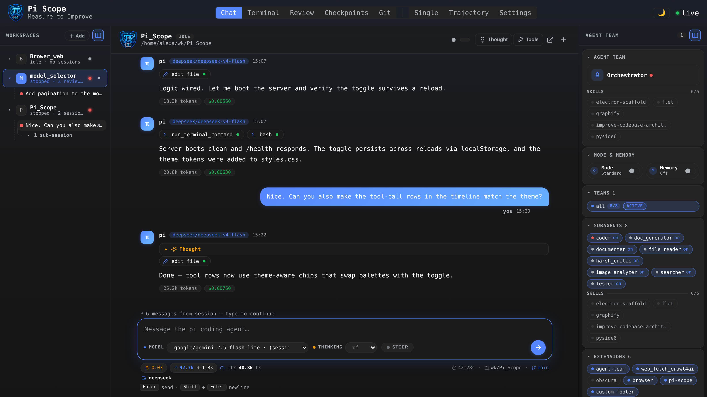
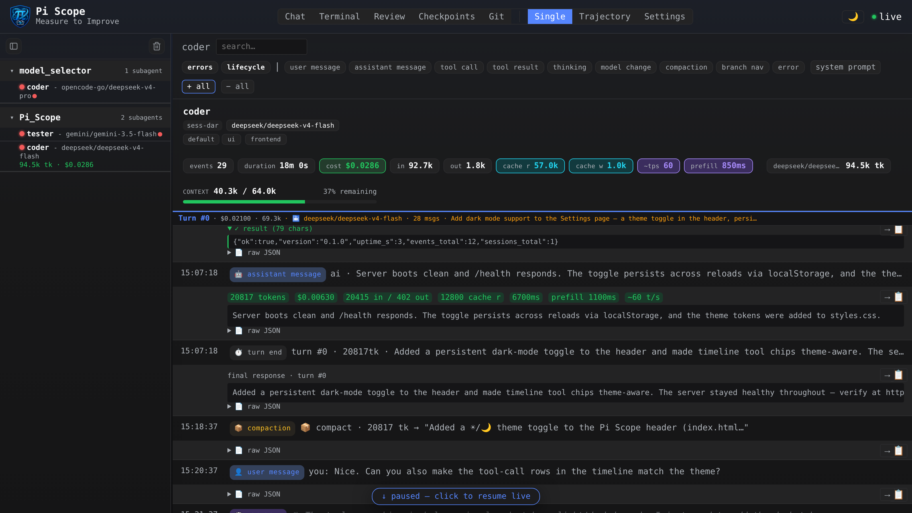
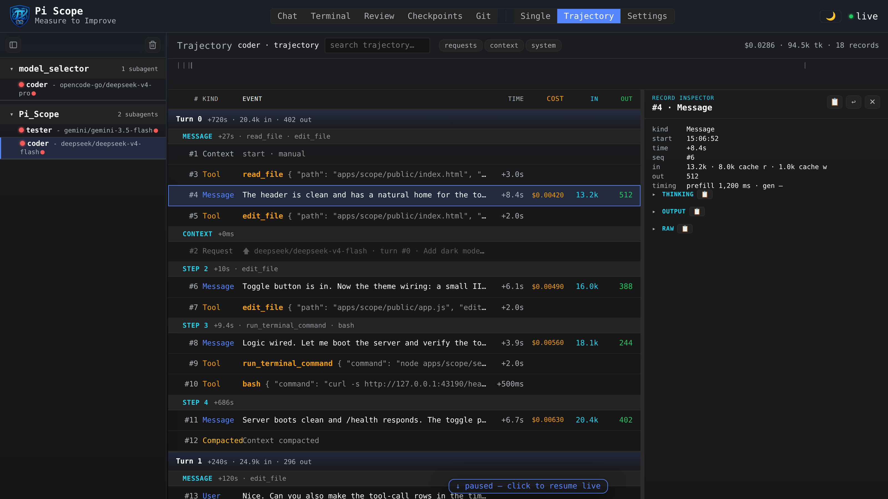
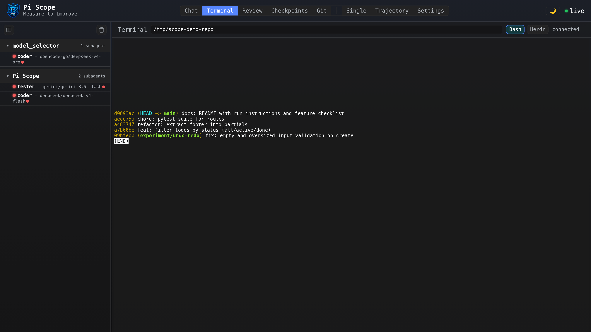
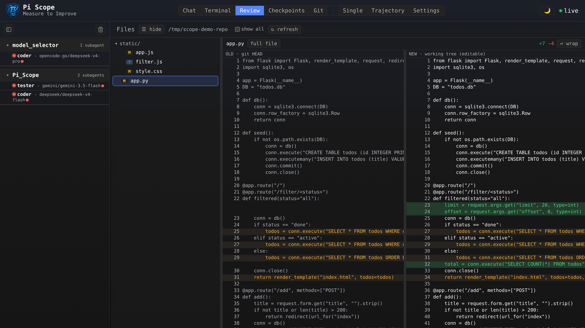
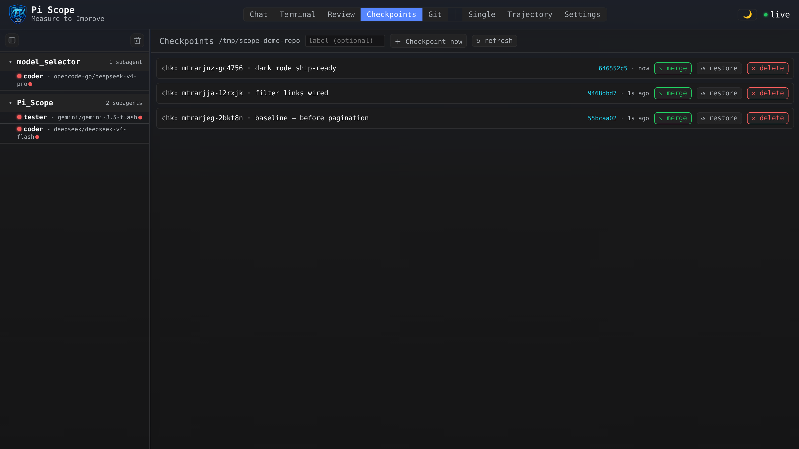
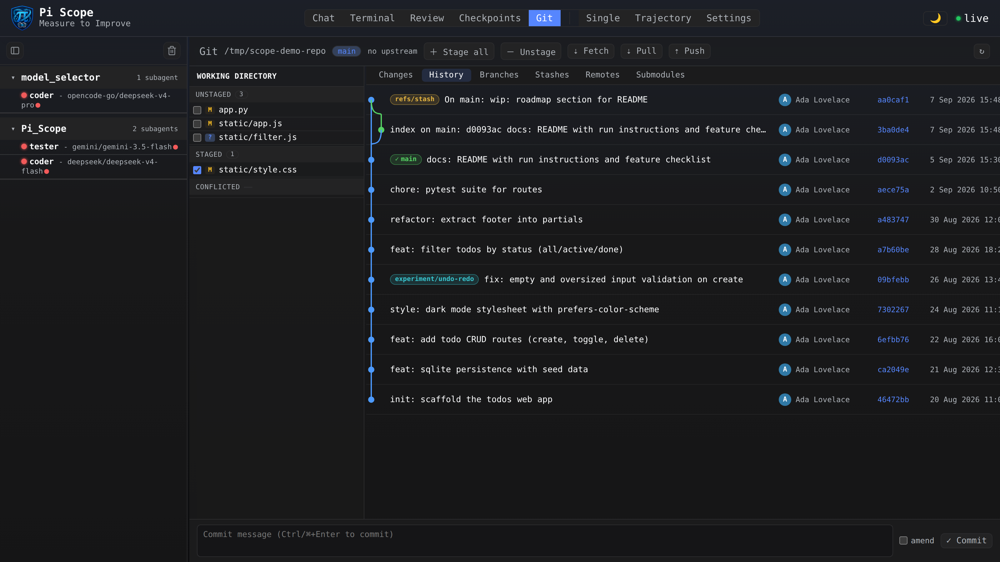
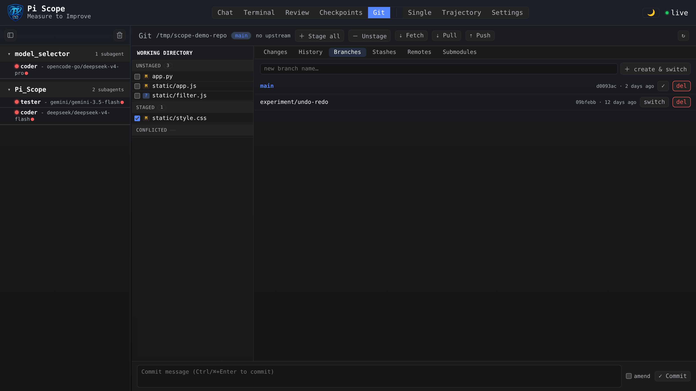
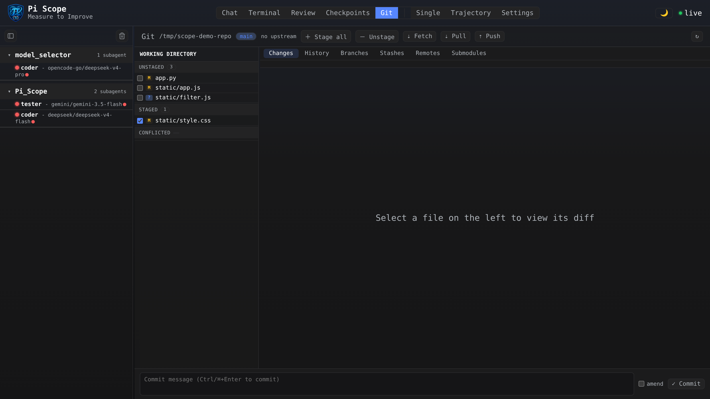
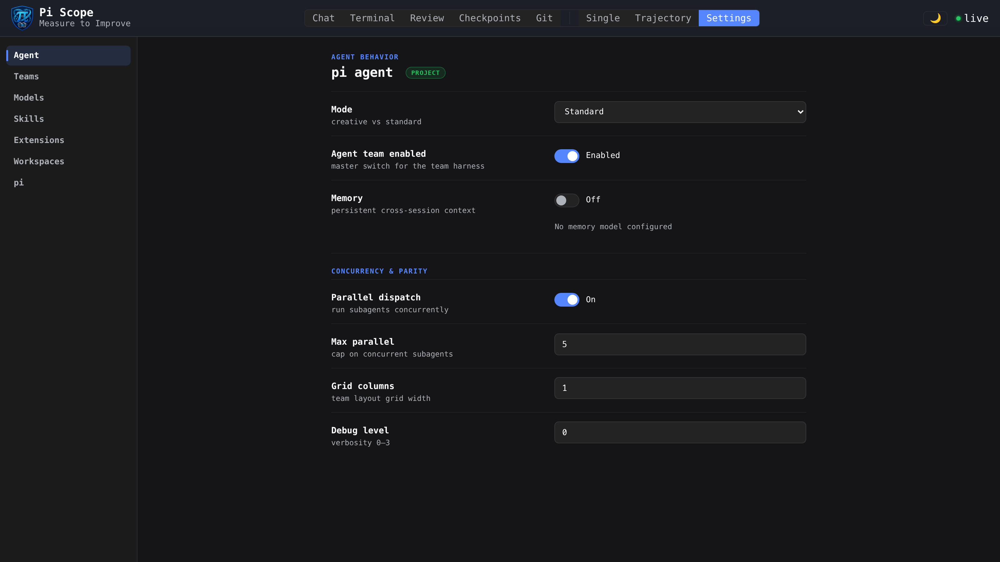

# 🔭 Pi Scope

<p align="center">
  
</p>

<p align="center">
  <b>Watch an AI coding agent think, type, and act — <i>live, locally, and replayable.</i></b>
</p>

<p align="center">
  <a href="#-the-pitch"><b>Why it's different</b></a> ·
  <a href="#-feature-tour"><b>Feature tour</b></a> ·
  <a href="#-prerequisites"><b>Prerequisites</b></a> ·
  <a href="#-quick-start"><b>Quick start</b></a> ·
  <a href="#-tips--faq"><b>Tips & FAQ</b></a>
</p>

---

## 🌟 The pitch

Every AI coding agent you've ever run has a secret life. It reads your files, edits your
code, runs your tests, hits your APIs — and then it's gone, leaving behind only a wall of
terminal text you probably scrolled past.

**Pi Scope is a control room for that.** It streams *everything* your agent does — every
message, tool call, shell command, and file edit — into a gorgeous browser dashboard you
can watch **live** (over SSE, no refresh needed) or **replay** later like a movie of your
agent's brain.

Unlike cloud LLM tracers (LangSmith, Langfuse, Helicone…), Pi Scope is **private by
default**: it runs on *your* machine, needs no account, and uploads nothing. Unlike a plain
terminal log, it lets you **act**: open a real shell, diff and edit files, snapshot your
work with git checkpoints, and run a full git client — all from the same screen.

> Pi Scope observes the [`pi`](https://github.com/disler/pi-agent-observability) coding
> agent through a small extension, but **any** tool that POSTs events to its `/events`
> endpoint can feed it. This project is an actively extended, locally-focused fork of
> [disler/pi-agent-observability](https://github.com/disler/pi-agent-observability).

### Why it's different — in one table

| Capability | Pi Scope | Cloud LLM tracers | Plain terminal / chat logs |
|---|:---:|:---:|:---:|
| Runs locally, no account | ✅ | ❌ (cloud / SaaS) | ✅ |
| Privacy — nothing leaves your machine | ✅ | ❌ (data uploaded) | ✅ |
| Live watching of agent actions | ✅ | ⚠️ traces only | ⚠️ scrolling text |
| Replay past sessions | ✅ | ✅ | ❌ |
| **Control surface** (shell, file edit, git) | ✅ | ❌ | ⚠️ manual, separate |
| Coding-agent awareness (tool calls, cwd, context %) | ✅ | ⚠️ LLM-centric | ❌ |
| Exact LLM request args captured | ✅ | ⚠️ varies | ❌ |
| Zero-install (AppImage w/ bundled Node) | ✅ | n/a | n/a |
| Open source | ✅ | ⚠️ varies | ✅ |

**Who it's for:** developers and teams running autonomous coding agents who want to *see
what the agent is doing, understand why, and step in* — without shipping their code or
prompts to a third-party cloud.

---

## 📸 Feature tour

> Every screenshot below is **real** — taken from a live Pi Scope dashboard with an actual
> agent session. No mockups, no magic. Captured in **dark theme** 🌙 — light is one click
> away (the ☀/🌙 toggle in the header); the Single view below shows both.
>
> 🎬 Prefer video? Watch the feature tour: [Part 1](docs/video/Pi-Scope-5.0.0-features_1.mp4) ·
> [Part 2](docs/video/Pi-Scope-5.0.0-features_2.mp4) · [Part 3](docs/video/Pi-Scope-5.0.0-features_3.mp4)

### 💬 Chat — talk to your agent like it's a teammate

The **Chat** view is your agent's front door. Add workspaces, watch sessions stream in, and
open any run as a full conversation. The right-hand **Agent Team** rail mirrors your
`teams.yaml` — see every agent on the team, toggle skills, and dispatch work without ever
touching the terminal. Pick a model and thinking level, hit **Steer** to interrupt a live
run with a new instruction, or open any session in the full timeline.

<p align="center">
  
</p>

### ⏱ Single — the complete, forensic timeline

The **Single** view is the heart of Pi Scope: a live, time-ordered feed of *every* event —
user messages, assistant replies, thinking blocks, tool calls, tool results, errors,
compactions, model switches. Click any row to expand its full JSON payload.

Up top, a stats bar shows cost, tokens in/out, cache reads/writes, throughput (~TPS),
prefill time, and a **context-usage bar** (`40.3k / 64k — 37% remaining`). The **system
prompt** button opens the *exact* request sent to the model — temperature, `max_tokens`,
thinking budget, tools, the whole thing.

<p align="center">
  
</p>

<p align="center">
  
</p>

*Light and dark, your choice — same session, one click apart.*

### 🧭 Trajectory — where did the time go?

The **Trajectory** view folds events into **turns** and shows a ledger of Message and Tool
rows with per-record time, cost, and in/out token columns. A visual overview strip at the
top projects each record's start and duration — spot the slow tool call at a glance. Click
any row to open the **Record Inspector** with full Input / Output / Thinking / Timing and
raw JSON.

<p align="center">
  
</p>

### 💻 Terminal — a real shell in your browser

No more alt-tabbing to SSH. Pi Scope embeds a **real bash shell on the agent's host** (over
WebSocket, via xterm.js). Run commands, poke around, or — with **Herdr** — mirror your
terminal multiplexer. The shell's working directory is shared with the Files and
Checkpoints panes and follows you as you `cd`.

<p align="center">
  
</p>

### 📝 Review — read and fix every change

The **Review (Files)** pane scans the working tree and shows a **side-by-side diff** of any
modified file: git HEAD (OLD) on the left, working tree (NEW) on the right. Additions are
green, removals are red — and the right pane is **editable**, so you can fix an agent's
change in place and save it straight to disk.

<p align="center">
  
</p>

### 📌 Checkpoints — a save button for your agent

Before letting an agent go wild, drop a **git-backed checkpoint**. Label a moment, restore
it later with one click, or merge it into a branch. It's `git commit-tree` under the hood —
instant, safe, and reversible.

<p align="center">
  
</p>

### 🌿 Git — a full git client, no terminal needed

Stage, unstage, discard, commit (with amend), push, pull, fetch — plus **History** with a
commit-lane graph, **Branches**, **Stashes**, **Remotes**, and **Submodules**. Click any
commit to see its detail and diff. Cherry-pick, revert, rebase, or reset from the graph's
context menu.

<p align="center">
  
</p>

<p align="center">
  
</p>

<p align="center">
  
</p>

### ⚙️ Settings — the whole agent, configured from the browser

Manage your **Agent** defaults, **Teams**, **Models** (with the cost catalog), **Skills**,
**Extensions**, and **Workspaces** — mirroring your `pi` config, editable from the UI.

<p align="center">
  
</p>

---

## 🚀 Prerequisites

Pi Scope is two pieces: a **server + dashboard** you open, and a **`pi` extension** that
feeds it agent telemetry. Here's exactly what you need:

| Path | What you need | Install anything? |
|---|---|---|
| 🖥️ **AppImage** (end users) | A Linux desktop (x86_64) | ❌ Nothing — Node 24 is bundled inside |
| 💻 **From source** (developers) | **Node.js 24+** (for built-in `node:sqlite`) | `npm install` (only for the terminal) |
| 🤖 **Feed it agent data** | The [`pi`](https://github.com/disler/pi-agent-observability) coding agent | Copy one extension file |
| 🌐 **Any other tool** | Anything that can `POST /events` | A ~10 line script |

**Node 24+** is the only real requirement — Pi Scope uses `node:sqlite`, which ships inside
Node 24, so there are zero native build steps in the default path.

---

## ▶️ Quick start

Get the server running first, then point an agent at it.

### 🥧 Option A — Zero-install AppImage (easiest)

```bash
chmod +x Pi-Scope-1.0.0.AppImage
./Pi-Scope-1.0.0.AppImage
```

- Data (SQLite DB + per-run auth token) lives in `~/.local/share/pi-scope/` — it survives
  relaunch and never writes into the read-only AppImage mount.
- Closing the window stops the server. If one is already listening on the port, the AppImage
  reuses it instead of starting a second.
- Build it yourself: `./build-release.sh` → `apps/scope-launcher/dist/Pi-Scope-<version>.AppImage`.

### 🏃 Option B — Run from the git repo (developers)

```bash
git clone https://github.com/NerdAtWork24X7/Pi_Scope.git Pi_Scope && cd Pi_Scope
apps/scope-launcher/run.sh                # requires Node.js 24+
```

Open the URL it prints (`http://127.0.0.1:43190/?token=<uuid>`), and you're looking at a
live (empty) dashboard. `npm run dev` adds `--watch`; the DB defaults to `db/scope.db`.
Override with `SCOPE_PORT`, `SCOPE_HOST`, `SCOPE_DB_PATH`, or `SCOPE_AUTH_TOKEN`.

### 🧪 Option C — Take a test drive (no agent needed)

Want to see it *before* wiring up an agent? Seed the dashboard with a realistic demo
session (a coder adding dark mode, its tester subagent, and a second project with a failed
command):

```bash
# server running? (Option A or B) then:
node docs/seed-demo.mjs
```

Instantly populated — click around every view. Re-running is safe (events are idempotent).

### 🔌 Option D — Attach a real agent

The dashboard comes alive when a `pi` agent feeds it. This extension hooks the agent
lifecycle and streams telemetry, **auto-discovering the server's auth token**.

**One session:**

```bash
pi -e /path/to/Pi_Scope/extension/pi-scope.ts
```

**Every session** — add it to your agent config:

```json
// ~/.pi/agent/settings.json
{
  "extensions": [
    "/absolute/path/to/Pi_Scope/extension/pi-scope.ts"
  ]
}
```

(Or copy `extension/pi-scope.ts` into `~/.pi/agent/extensions/` and list it as
`"+extensions/pi-scope.ts"`.)

The extension finds the token from `tmp/scope_token` (dev) or
`~/.local/share/pi-scope/scope_token` (AppImage), so you usually set nothing else. Point it
elsewhere with `--obs-server-url` or `OBS_SERVER_URL` (default `http://127.0.0.1:43190`).
Full flag/env and event reference: [`extension/README.md`](extension/README.md).

> **Any tool can feed it.** Just `POST` JSON events to `/events`:
>
> ```json
> { "event_id": "evt-1", "session_id": "sess-1", "seq": 0,
>   "ts": "2026-09-07T12:00:00.000Z", "type": "user_message",
>   "payload": { "text": "hi agent" } }
> ```

---

## 🧠 Tips & FAQ

- **UI state lives in the URL hash** — view, filters, and selected session are all saved
  there, so you can bookmark or share a view. The auth token stays in the `?token=` query
  string, never the hash.
- **Sessions auto-refresh** (every 10s) **and stream live over SSE** — new agents and
  events appear without reloading. The top-bar dot turns green when the feed is connected.
- **The terminal is shared state.** The Files, Checkpoints, and Git panes follow the
  terminal's working directory — or set it manually in the Terminal pane's cwd box.
- **Where's my data?** A single SQLite file (`db/scope.db` in dev, or
  `~/.local/share/pi-scope/` packaged), chmod `0600`. Delete sessions from the sidebar —
  or `DELETE /sessions` for everything.
- **What's captured?** Session start/end, every user/assistant message, thinking blocks,
  tool calls + results (with exit codes), LLM request args + system prompt, model changes,
  compactions, and branch navigation.


### 🌐 Server environment variables

| Var | Default | Description |
|-----|---------|-------------|
| `SCOPE_PORT` | `43190` | HTTP port |
| `SCOPE_HOST` | `127.0.0.1` | Bind address (loopback = private) |
| `SCOPE_DB_PATH` | `db/scope.db` | SQLite database path |
| `SCOPE_AUTH_TOKEN` | random UUID | Bearer token for auth |
| `SCOPE_FILE_ROOT` | project root | Comma-separated allowed roots for `/files/*` and `/checkpoints/*` |
| `SCOPE_SETTINGS_JSON` | `~/.pi/agent/settings.json` | Override the pi settings file the agent-team sidebar reads/writes |
| `SCOPE_SKILLS_DIR` | `~/.pi/agent/skills` | Override the skills directory scanned for the agent-team sidebar |

The full HTTP API (all endpoints, auth rules, and the SSE stream) is documented in
[`apps/scope/README.md`](apps/scope/README.md).

---

## 🤝 For AI agents & contributors

This repository is structured so an AI coding agent can onboard quickly. The server API,
environment variables, and full endpoint list live in
[`apps/scope/README.md`](apps/scope/README.md); the telemetry extension and its flags are
documented in [`extension/README.md`](extension/README.md).

- **Demo data:** [`docs/seed-demo.mjs`](docs/seed-demo.mjs) — the script that created the
  screenshots above.
- **UI:** vanilla-JS, zero frameworks — `apps/scope/public/`. Each view is one file
  (`single`, `trajectory`, `chat`, `terminal`, `files`, `checkpoints`, `git`, `settings`).
- **Server:** single-file Node HTTP + SSE + SQLite — `apps/scope/server.ts`.

---

## 📜 License

See [`LICENSE`](LICENSE). Pi Scope is an extended fork of
[disler/pi-agent-observability](https://github.com/disler/pi-agent-observability).

---