# 🔭 Pi Scope

<p align="center">
  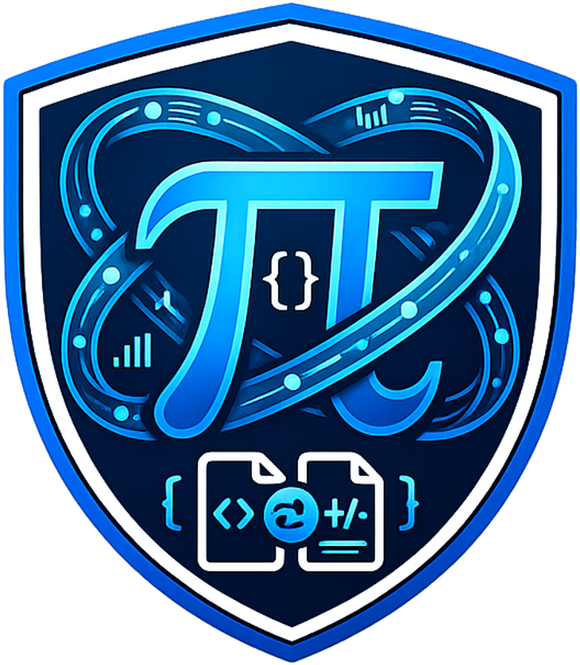
</p>

<p align="center">
  <b>Watch an AI coding agent think, type, and act — <i>live, locally, and replayable.</i></b>
</p>

<p align="center">
  <a href="#-the-pitch"><b>Why it's different</b></a> ·
  <a href="#-feature-tour"><b>Feature tour</b></a> ·
  <a href="#-prerequisites"><b>Prerequisites</b></a> ·
  <a href="#-quick-start"><b>Quick start</b></a> ·
  <a href="#-tips--faq"><b>Tips & FAQ</b></a>
</p>

---

## 🌟 The pitch

Every AI coding agent you've ever run has a secret life. It reads your files, edits your
code, runs your tests, hits your APIs — and then it's gone, leaving behind only a wall of
terminal text you probably scrolled past.

**Pi Scope is a control room for that.** It streams *everything* your agent does — every
message, tool call, shell command, and file edit — into a gorgeous browser dashboard you
can watch **live** (over SSE, no refresh needed) or **replay** later like a movie of your
agent's brain.

Unlike cloud LLM tracers (LangSmith, Langfuse, Helicone…), Pi Scope is **private by
default**: it runs on *your* machine, needs no account, and uploads nothing. Unlike a plain
terminal log, it lets you **act**: open a real shell, diff and edit files, snapshot your
work with git checkpoints, and run a full git client — all from the same screen.

> Pi Scope observes the [`pi`](https://github.com/disler/pi-agent-observability) coding
> agent through a small extension, but **any** tool that POSTs events to its `/events`
> endpoint can feed it. This project is an actively extended, locally-focused fork of
> [disler/pi-agent-observability](https://github.com/disler/pi-agent-observability).

### Why it's different — in one table

| Capability | Pi Scope | Cloud LLM tracers | Plain terminal / chat logs |
|---|:---:|:---:|:---:|
| Runs locally, no account | ✅ | ❌ (cloud / SaaS) | ✅ |
| Privacy — nothing leaves your machine | ✅ | ❌ (data uploaded) | ✅ |
| Live watching of agent actions | ✅ | ⚠️ traces only | ⚠️ scrolling text |
| Replay past sessions | ✅ | ✅ | ❌ |
| **Control surface** (shell, file edit, git) | ✅ | ❌ | ⚠️ manual, separate |
| Coding-agent awareness (tool calls, cwd, context %) | ✅ | ⚠️ LLM-centric | ❌ |
| Exact LLM request args captured | ✅ | ⚠️ varies | ❌ |
| Zero-install (AppImage w/ bundled Node) | ✅ | n/a | n/a |
| Open source | ✅ | ⚠️ varies | ✅ |

**Who it's for:** developers and teams running autonomous coding agents who want to *see
what the agent is doing, understand why, and step in* — without shipping their code or
prompts to a third-party cloud.

---

## 📸 Feature tour

> Every screenshot below is **real** — taken from a live Pi Scope dashboard with an actual
> agent session. No mockups, no magic. Captured in **dark theme** 🌙 — light is one click
> away (the ☀/🌙 toggle in the header); **Chat** and **Single** below show both.
>
> 🎬 Prefer video? Watch the feature tour: [Part 1](docs/video/Pi-Scope-5.0.0-features_1.mp4) ·
> [Part 2](docs/video/Pi-Scope-5.0.0-features_2.mp4) · [Part 3](docs/video/Pi-Scope-5.0.0-features_3.mp4) ·
> [Full showcase](docs/video/Pi-Scope-showcase.mp4)

### 💬 Chat — talk to your agent like it's a teammate

The **Chat** view is your agent's front door. Add workspaces, watch sessions stream in, and
open any run as a full conversation. The right-hand **Agent Team** rail mirrors your
`teams.yaml` — see every agent on the team, toggle skills, and dispatch work without ever
touching the terminal. Pick a model and thinking level, hit **Steer** to interrupt a live
run with a new instruction, or open any session in the full timeline.

<p align="center">
  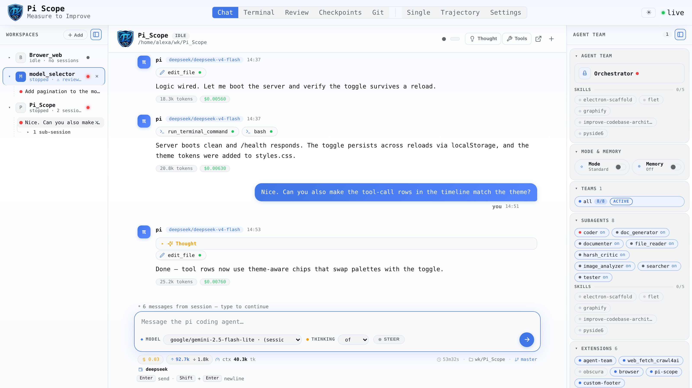
</p>

<p align="center">
  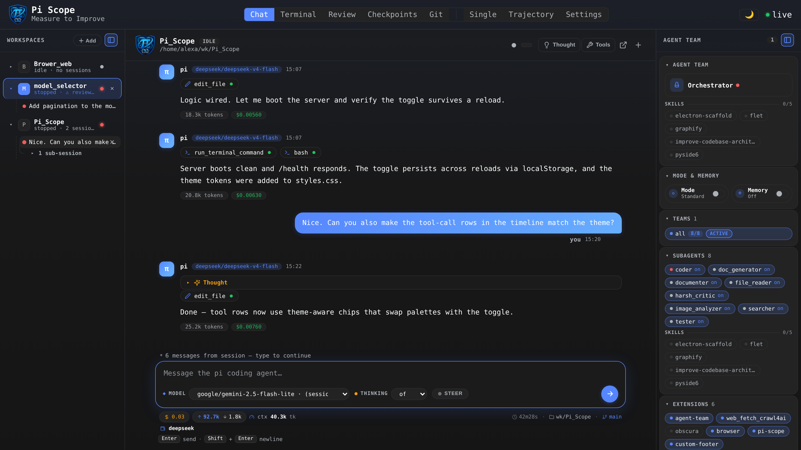
</p>

*Light and dark, your choice — same session, one click apart.*

### ⏱ Single — the complete, forensic timeline

The **Single** view is the heart of Pi Scope: a live, time-ordered feed of *every* event —
user messages, assistant replies, thinking blocks, tool calls, tool results, errors,
compactions, model switches. Click any row to expand its full JSON payload.

Up top, a stats bar shows cost, tokens in/out, cache reads/writes, throughput (~TPS),
prefill time, and a **context-usage bar** (`40.3k / 64k — 37% remaining`). The **system
prompt** button opens the *exact* request sent to the model — temperature, `max_tokens`,
thinking budget, tools, the whole thing.

<p align="center">
  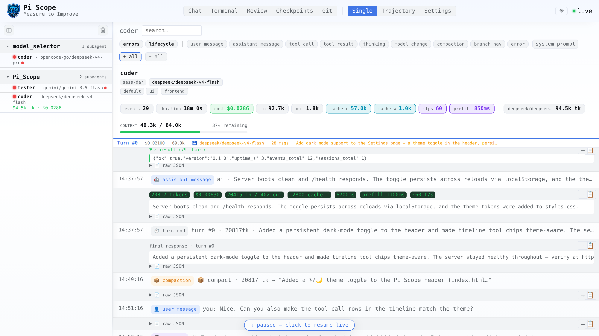
</p>

<p align="center">
  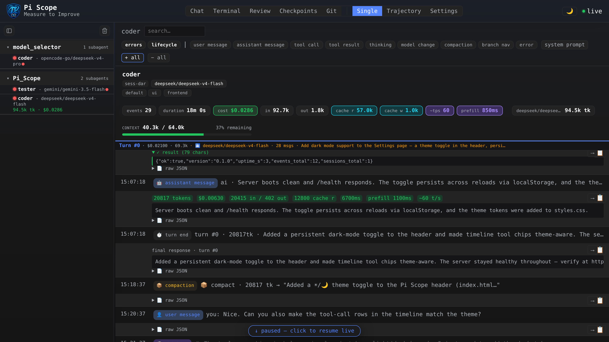
</p>

*Light and dark, your choice — same session, one click apart.*

### 🧭 Trajectory — where did the time go?

The **Trajectory** view folds events into **turns** and shows a ledger of Message and Tool
rows with per-record time, cost, and in/out token columns. A visual overview strip at the
top projects each record's start and duration — spot the slow tool call at a glance. Click
any row to open the **Record Inspector** with full Input / Output / Thinking / Timing and
raw JSON.

<p align="center">
  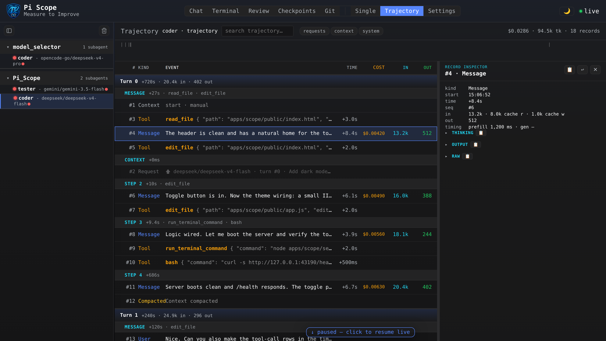
</p>

### 💻 Terminal — a real shell in your browser

No more alt-tabbing to SSH. Pi Scope embeds a **real bash shell on the agent's host** (over
WebSocket, via xterm.js). Run commands, poke around, or — with **Herdr** — mirror your
terminal multiplexer. The shell's working directory is shared with the Files and
Checkpoints panes and follows you as you `cd`.

<p align="center">
  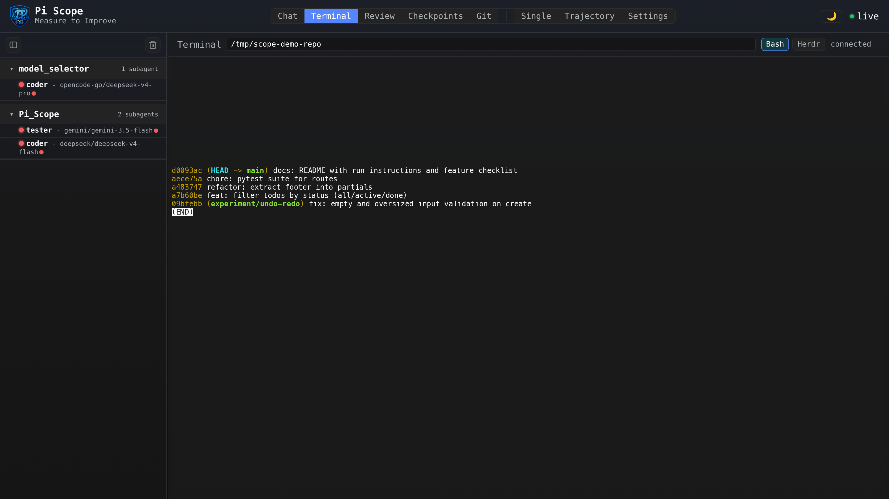
</p>

### 📝 Review — read and fix every change

The **Review (Files)** pane scans the working tree and shows a **side-by-side diff** of any
modified file: git HEAD (OLD) on the left, working tree (NEW) on the right. Additions are
green, removals are red — and the right pane is **editable**, so you can fix an agent's
change in place and save it straight to disk.

<p align="center">
  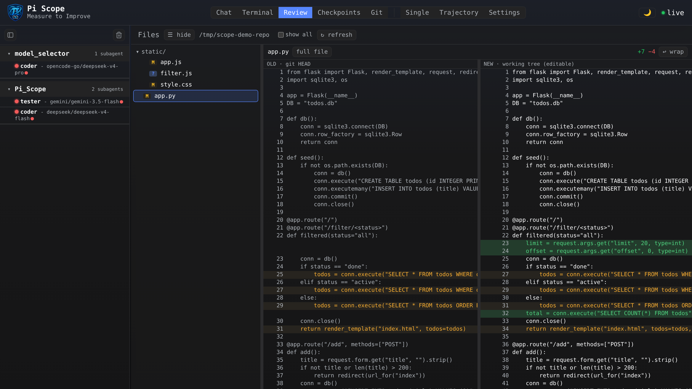
</p>

### 📌 Checkpoints — a save button for your agent

Before letting an agent go wild, drop a **git-backed checkpoint**. Label a moment, restore
it later with one click, or merge it into a branch. It's `git commit-tree` under the hood —
instant, safe, and reversible.

<p align="center">
  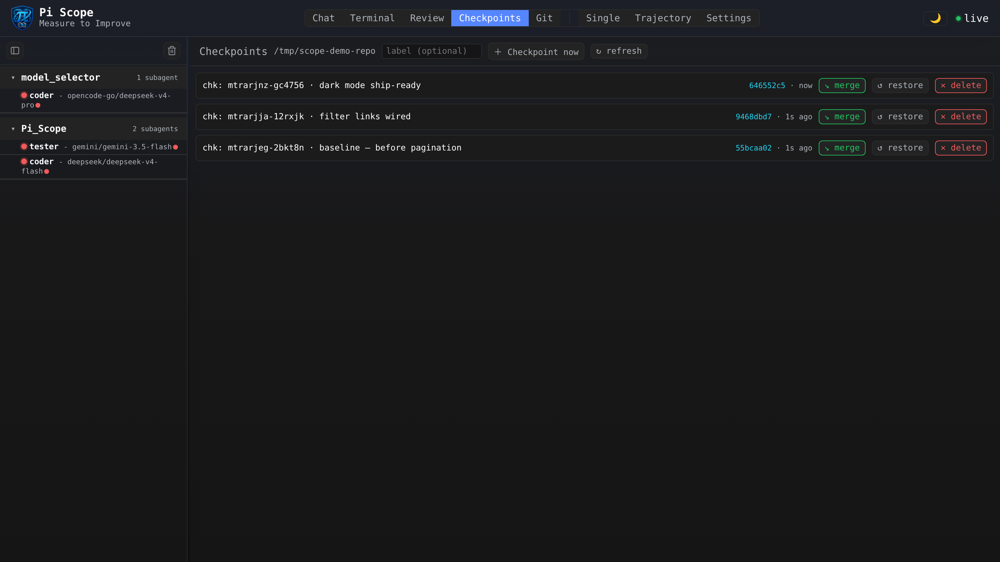
</p>

### 🌿 Git — a full git client, no terminal needed

Stage, unstage, discard, commit (with amend), push, pull, fetch — plus **History** with a
commit-lane graph, **Branches**, **Stashes**, **Remotes**, and **Submodules**. Click any
commit to see its detail and diff. Cherry-pick, revert, rebase, or reset from the graph's
context menu. Stuck on a message? **✨ generate** drafts one from the pending diff (staged, or
the working tree when nothing is staged) — pick the model and edit the instruction template in
**Settings → Models**; both default to the agent's model and a Conventional Commits prompt.

<p align="center">
  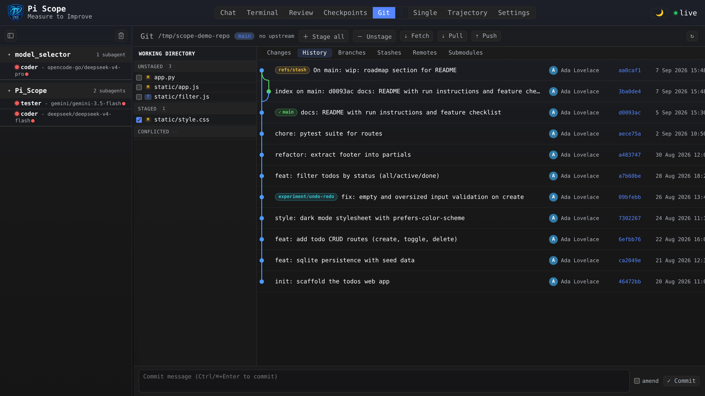
</p>

<p align="center">
  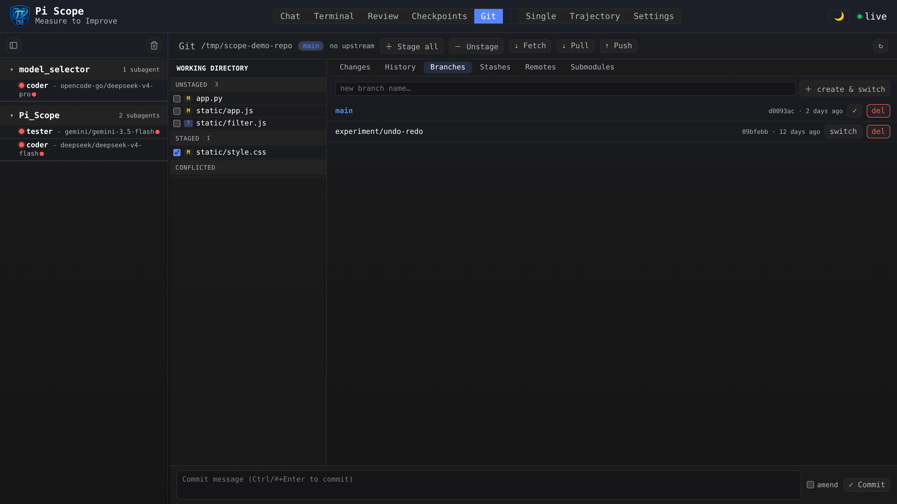
</p>

<p align="center">
  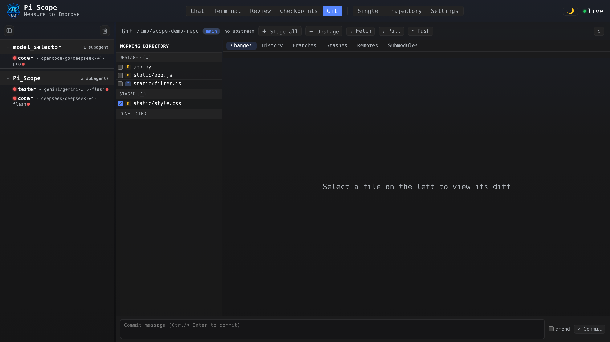
</p>

### ⚙️ Settings — the whole agent, configured from the browser

Manage your **Agent** defaults, **Teams**, **Models** (with the cost catalog), **Skills**,
**Extensions**, **Workspaces**, and **Plugins** — mirroring your `pi` config, editable from the UI.

<p align="center">
  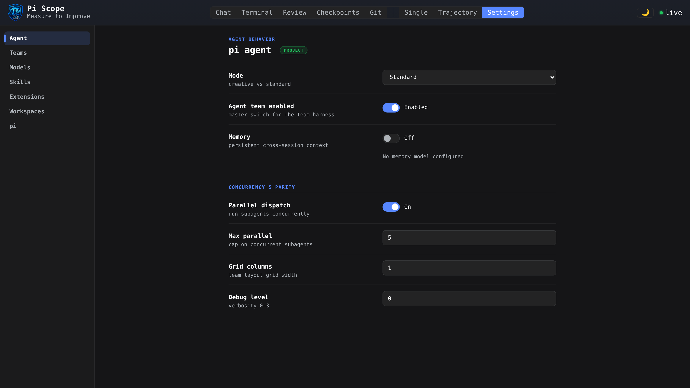
</p>

### 🧩 Plugins — every feature, and yours too

Every header view — **Chat, Terminal, Review, Checkpoints, Git, Single, Trajectory** — is a
**plugin**. Enable or disable any of them from **Settings → Plugins**: the view disappears and,
server-side, the routes that feature owns are refused. You can add your own plugin by dropping a
folder with a `plugin.json` (plus an optional `server.js` / `client.js`) into
`~/.pi-scope/plugins/`: it gets a header button and view, its own HTTP routes on the server, a hook
on every ingested event, and its own persistent JSON state. See
[`apps/scope-server/plugins/README.md`](apps/scope-server/plugins/README.md) and the working
example in [`examples/plugins/hello-insights/`](examples/plugins/hello-insights/).

---

## 🚀 Prerequisites

Pi Scope is two pieces: a **server + dashboard** you open, and a **`pi` extension** that
feeds it agent telemetry. Here's exactly what you need:

| Path | What you need | Install anything? |
|---|---|---|
| 🖥️ **AppImage** (end users) | A Linux desktop (x86_64) | ❌ Nothing — Node 24 is bundled inside |
| 💻 **From source** (developers) | **Node.js 24+** (for built-in `node:sqlite`) | `npm install` (only for the terminal) |
| 🤖 **Feed it agent data** | The [`pi`](https://github.com/disler/pi-agent-observability) coding agent — **bundled** | ❌ Nothing — Pi Scope ships its own `pi` |
| 🌐 **Any other tool** | Anything that can `POST /events` | A ~10 line script |

**Node 24+** is the only real requirement — Pi Scope uses `node:sqlite`, which ships inside
Node 24, so there are zero native build steps in the default path.

---

## ▶️ Quick start

Get the server running first, then point an agent at it.

### 🥧 Option A — Zero-install AppImage (easiest)

```bash
chmod +x Pi-Scope-1.0.0.AppImage
./Pi-Scope-1.0.0.AppImage
```

- Data (SQLite DB + per-run auth token) lives in `~/.pi-scope/` — it survives
  relaunch and never writes into the read-only AppImage mount.
- Closing the window stops the server. If one is already listening on the port, the AppImage
  reuses it instead of starting a second.
- Build it yourself: `./build-release.sh` → `apps/scope-desktop/dist/Pi-Scope-<version>.AppImage`.

### 🚀 Option B — One command (the whole stack)

```bash
git clone https://github.com/NerdAtWork24X7/Pi_Scope.git Pi_Scope && cd Pi_Scope
./Start.sh                               # desktop app (Electron window)
```

`Start.sh` is the single entry point for every mode — it picks a sane Node (nvm-aware),
boots the server and the app together, and on Ctrl-C stops only the server it started. The
one exception to "no setup": in desktop mode it runs `npm install` **once**, on first run
only, to get Electron.

```bash
./Start.sh                              # desktop app (Electron window, default)
./Start.sh --web                        # headless server + open the WebUI in a browser
./Start.sh --server                     # headless server only, stays in the foreground
./Start.sh --dev                        # server with --watch
./Start.sh --keep-server                # leave the server up after the script exits
./Start.sh --port 8080 --host 0.0.0.0   # override the defaults
./Start.sh --db /path/to/scope.db --token my-token
```

The server is started **at most once**: if one is already healthy on the target port, its
token is adopted instead of a second instance being spawned, and a server orphaned by a
`kill -9` is reaped on the next run. Per-machine defaults can live in
`apps/scope-desktop/scope.env` (see `scope.env.example`); real environment variables always
win.

### 🏃 Option C — Run from the git repo (developers)

```bash
git clone https://github.com/NerdAtWork24X7/Pi_Scope.git Pi_Scope && cd Pi_Scope
apps/scope-desktop/run.sh                # requires Node.js 24+
```

Open the URL it prints (`http://127.0.0.1:43190/?token=<uuid>`), and you're looking at a
live (empty) dashboard. `npm run dev` adds `--watch`; the DB defaults to `db/scope.db`.
Override with `SCOPE_PORT`, `SCOPE_HOST`, `SCOPE_DB_PATH`, or `SCOPE_AUTH_TOKEN`.

### 🧪 Option D — Take a test drive (no agent needed)

Want to see it *before* wiring up an agent? Seed the dashboard with a realistic demo
session (a coder adding dark mode, its tester subagent, and a second project with a failed
command):

```bash
# server running? (Option A, B or C) then:
node docs/seed-demo.mjs
```

Instantly populated — click around every view. Re-running is safe (events are idempotent).

### 🔌 Option E — Attach a real agent

The dashboard comes alive when a `pi` agent feeds it. This extension hooks the agent
lifecycle and streams telemetry, **auto-discovering the server's auth token**.

**Pi Scope bundles its own `pi` coding agent.** The Chat view, the git-commit-message
generator, and the in-browser Terminal all launch that bundled copy — with the Pi Scope
extension force-loaded — so there is nothing to install and a separate global `pi` is
never used. The bundled agent lives in `apps/scope-desktop/pi-bundle` (packaged as
`resources/pi` inside the AppImage); point elsewhere with `SCOPE_PI_BIN`.

The bundled agent also keeps its **own agent dir** (`~/.pi-scope/agent`, see
`SCOPE_AGENT_DIR`). Its settings, API keys, model store, sessions and extensions live
there, so it never reads or writes your global pi agent dir — the two installations do
not interfere, and a `pi-scope.ts` listed in your global config can't collide with the
force-loaded copy.

The steps below are only for a `pi` you installed yourself and run outside Pi Scope
(e.g. in your own terminal). That agent runs as normal — nothing to learn, no new
commands:

<p align="center">
  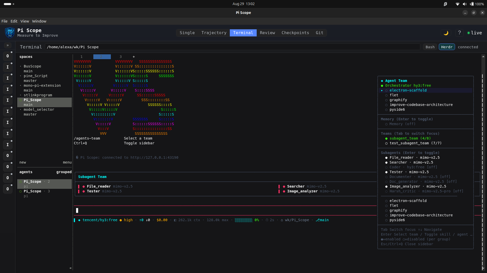
</p>

*That's the agent side. Everything it does — every message, tool call, shell command and
file edit — shows up in the Pi Scope dashboard in real time.*

**One session:**

```bash
pi -e /path/to/Pi_Scope/extension/pi-scope.ts
```

**Every session** — add it to your agent config:

```json
// your pi agent dir's settings.json
{
  "extensions": [
    "/absolute/path/to/Pi_Scope/extension/pi-scope.ts"
  ]
}
```

(Or copy `extension/pi-scope.ts` into your pi agent dir's `extensions/` folder and list it as
`"+extensions/pi-scope.ts"`.)

The extension finds the token from `tmp/scope_token` (dev) or
`~/.pi-scope/scope_token` (AppImage), so you usually set nothing else. Point it
elsewhere with `--obs-server-url` or `OBS_SERVER_URL` (default `http://127.0.0.1:43190`).
Full flag/env and event reference: [`extension/README.md`](extension/README.md).

> **Any tool can feed it.** Just `POST` JSON events to `/events`:
>
> ```json
> { "event_id": "evt-1", "session_id": "sess-1", "seq": 0,
>   "ts": "2026-09-07T12:00:00.000Z", "type": "user_message",
>   "payload": { "text": "hi agent" } }
> ```

---

## 🧠 Tips & FAQ

- **UI state lives in the URL hash** — view, filters, and selected session are all saved
  there, so you can bookmark or share a view. The auth token stays in the `?token=` query
  string, never the hash.
- **Sessions auto-refresh** (every 10s) **and stream live over SSE** — new agents and
  events appear without reloading. The top-bar dot turns green when the feed is connected.
- **The terminal is shared state.** The Files, Checkpoints, and Git panes follow the
  terminal's working directory — or set it manually in the Terminal pane's cwd box.
- **One rail, every view.** The **Workspaces rail** on the left is the same component in
  every view: pick a workspace and it becomes the shared working directory (Terminal `cd`s
  there, Review/Git/Checkpoints re-scan it), fold subagent groups open or closed, open a
  session straight into Single or Trajectory, or delete it from the rail.
- **Where's my data?** A single SQLite file (`db/scope.db` in dev, or
  `~/.pi-scope/` packaged), chmod `0600`. Delete sessions from the sidebar —
  or `DELETE /sessions` for everything.
- **What's captured?** Session start/end, every user/assistant message, thinking blocks,
  tool calls + results (with exit codes), LLM request args + system prompt, model changes,
  compactions, and branch navigation.


### 📱 Use it from your phone

Pi Scope can bind every interface so a phone on the same Wi-Fi can open the **Chat** view
live, alongside the desktop.

**1. Bind to the LAN.** Copy the settings template and turn the bind on:

```bash
cp apps/scope-desktop/scope.env.example apps/scope-desktop/scope.env
# then uncomment:  SCOPE_HOST=0.0.0.0
```

`scope.env` is read at launch, so this works from the desktop icon too (which inherits no
shell environment). Real environment variables still win, so `SCOPE_HOST=0.0.0.0 ./run.sh`
overrides the file.

**2. Start Pi Scope and click the phone icon** in the header. A QR appears — point your
phone's camera at it and the Chat view opens. The QR already carries this run's auth token,
so bookmark it rather than sharing it. If the machine has more than one network interface
(wifi, ethernet, docker), pick the address the phone can actually reach.

> ⚠️ **This exposes a shell.** With `SCOPE_HOST=0.0.0.0` anyone on that network who knows
> the token gets the full UI — including **Terminal**, a real shell on the host — plus file
> edits and git operations. Only do this on a network you trust. The token is minted
> randomly at boot; pin `SCOPE_AUTH_TOKEN` in `scope.env` if you want a stable URL.

Running from source instead of the launcher? `SCOPE_HOST=0.0.0.0 npm start` in
`apps/scope-server` works the same way; the boot banner prints the phone URL.

---

### 🌐 Server environment variables

| Var | Default | Description |
|-----|---------|-------------|
| `SCOPE_PORT` | `43190` | HTTP port |
| `SCOPE_HOST` | `127.0.0.1` | Bind address. `0.0.0.0` also serves your LAN — see [Use it from your phone](#-use-it-from-your-phone) |
| `SCOPE_DB_PATH` | `db/scope.db` | SQLite database path |
| `SCOPE_AUTH_TOKEN` | random UUID | Bearer token for auth |
| `SCOPE_FILE_ROOT` | project root | Comma-separated allowed roots for `/files/*` and `/checkpoints/*` |
| `SCOPE_AGENT_DIR` | `~/.pi-scope/agent` | Pi Scope's **own** pi agent dir (settings, API keys, model store, sessions). The bundled `pi` is pinned here via `PI_CODING_AGENT_DIR`, so it never touches the global pi agent dir. |
| `SCOPE_SETTINGS_JSON` | `<agentDir>/settings.json` | Override the pi settings file the agent-team sidebar reads/writes |
| `SCOPE_SKILLS_DIR` | `<agentDir>/skills` | Override the skills directory scanned for the agent-team sidebar |
| `SCOPE_PLUGINS_DIR` | `~/.pi-scope/plugins` | Where user plugins live (enable/disable state in `plugins.json`, namespaced state in `.data/`) |
| `SCOPE_EXTRA_PATH` | — | Colon-separated extra dirs prepended to `PATH` for chat-spawned `pi` subprocesses (e.g. a non-standard venv: `SCOPE_EXTRA_PATH=/path/to/.venv/bin`) |
| `SCOPE_PI_BIN` | bundled `pi` | Override the `pi` executable Pi Scope launches for Chat, commit messages and subagents. Set it to use a different `pi` than the bundled one (or to stub it in tests). |
| `SCOPE_PI_BUNDLE_DIR` | auto-detected | Where the bundled `pi` lives (`apps/scope-desktop/pi-bundle` in dev, `resources/pi` packaged). Set by the packaged launcher; only override for an out-of-tree bundle. |

Chat-spawned `pi` subprocesses also get the workspace venv bin dirs prepended to
`PATH`, and `PLAYWRIGHT_BROWSERS_PATH` restored from the user's shell rc files
(or Playwright's default cache dirs) when the server env lacks it — so
`web-fetch` finds its Chromium browser even when the server was launched from a
GUI session that never sourced the shell rc.

The full HTTP API (all endpoints, auth rules, and the SSE stream) is documented in
[`apps/scope-server/README.md`](apps/scope-server/README.md).

---

## 🤝 For AI agents & contributors

This repository is structured so an AI coding agent can onboard quickly. The server API,
environment variables, and full endpoint list live in
[`apps/scope-server/README.md`](apps/scope-server/README.md); the telemetry extension and its flags are
documented in [`extension/README.md`](extension/README.md).

Every feature is a plugin, so the fastest way to change Pi Scope's behaviour is usually to
write one rather than edit the core. Start with
[`apps/scope-server/plugins/README.md`](apps/scope-server/plugins/README.md) — it covers
manifests, the `api.route` / `api.onEvent` / `api.store` / `api.log` API, client bundles, and
where state is persisted — and copy the working example in
[`examples/plugins/hello-insights/`](examples/plugins/hello-insights/).

- **Demo data:** [`docs/seed-demo.mjs`](docs/seed-demo.mjs) — the script that created the
  screenshots above.
- **UI:** vanilla-JS, zero frameworks — `apps/scope-server/public/`. Views are plugins:
  `plugins.js` is the client host/registry, `plugins-builtin.js` registers the shipped views
  (`single`, `trajectory`, `chat`, `terminal`, `files`, `checkpoints`, `git`, `settings`), and
  `app.js` `setView()` is registry-driven — it knows no view by name.
- **Plugins:** `apps/scope-server/plugins.ts` is the server host (discovery, enable/disable,
  route gating, event hooks, per-plugin storage); `apps/scope-server/plugins/` holds the built-in
  feature manifests; `examples/plugins/` has an installable example. Docs:
  [`apps/scope-server/plugins/README.md`](apps/scope-server/plugins/README.md).
- **Server:** single-file Node HTTP + SSE + SQLite — `apps/scope-server/server.ts`.

---

## 📜 License

See [`LICENSE`](LICENSE). Pi Scope is an extended fork of
[disler/pi-agent-observability](https://github.com/disler/pi-agent-observability).

---